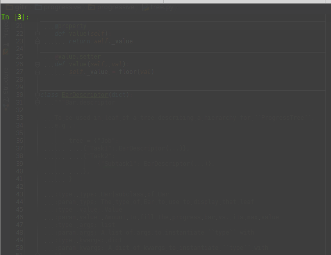

.. contents::
   :depth: 3
..

``progressive``
===============

Progress bars for your terminal, powered by
`blessings <https://github.com/erikrose/blessings>`__. Compatible with
both Python 2 and 3.

Introduction
------------

``progressive`` lets you view progress of complex workflows as well as
simple ones:

   Image
Installation
------------

-  For the possibly stable

::

    pip install progressive

-  For the latest and greatest

::

    git clone https://github.com/hfaran/progressive.git
    cd progressive
    python setup.py install

Getting Started
---------------

Documentation is coming soon, but in the meantime check out the
`examples <https://github.com/hfaran/progressive/blob/master/examples.py>`__.
